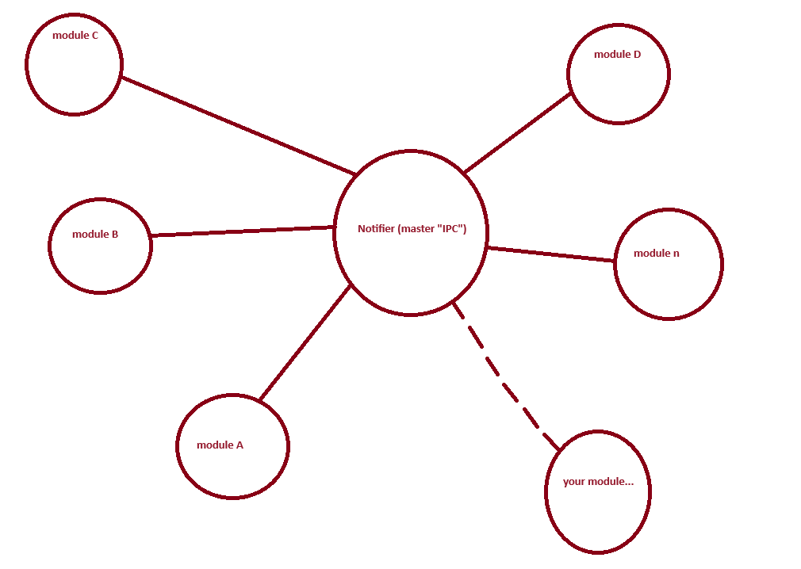

# livectf 

Livectf is a ctf hosting platform written in Rust. Easy maintaining and developing through module model.



# For author

Challenge template is compulsory:

```
chall/
├─ dist/
│  ├─ run (this is program entry, just like redjail)
│  ├─ your stuffs bla bla...
├─ Dockerfile
```

and compress to chall.tar.gz with:
`tar caf chall.tar.gz chall/`

An example of how challenge should before upload is in CHALLENGE_TEST_AREA, else the upload will not be successful.